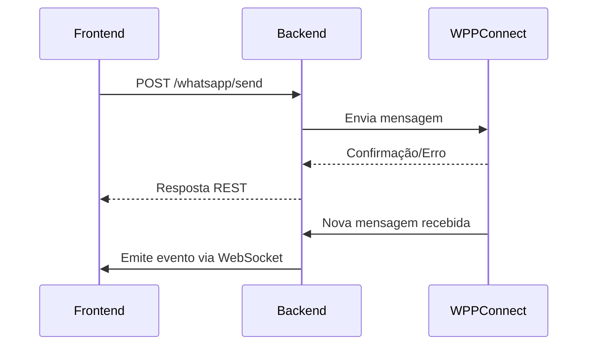

# 🚀 Backend WhatsApp Integration (WPPConnect)

> Solução backend avançada para integração com WhatsApp, baseada em WPPConnect, Express e Socket.IO. Oferece comunicação em tempo real, API REST robusta, arquitetura escalável e pronta para SaaS.

---

## 📂 Estrutura de Diretórios

A organização dos arquivos facilita a manutenção, escalabilidade e entendimento do projeto:

```text
backend/
├── index.js             # Ponto de entrada: inicializa Express, configura rotas, CORS, JSON e WebSocket
├── socket.js            # Gerencia conexões WebSocket, eventos e integração com WPPConnect
├── routes/
│   └── whatsapp.js      # Rotas REST para envio/recebimento de mensagens e webhooks
└── services/
  └── wppconnect.js    # Serviço de integração direta com @wppconnect-team/wppconnect, simulação e callbacks
```

- **index.js:** Centraliza a configuração do servidor, middleware e inicialização dos principais módulos.
- **socket.js:** Responsável pela comunicação em tempo real, emitindo e recebendo eventos via Socket.IO.
- **routes/whatsapp.js:** Define endpoints REST para operações relacionadas ao WhatsApp.
- **services/wppconnect.js:** Abstrai a integração com o WPPConnect, permitindo simulação e tratamento de mensagens.

Essa estrutura modular permite fácil expansão para novos serviços, rotas ou integrações.

---

## 📝 Visão Geral

Este backend foi desenvolvido para ser:

- **Moderno:** Utiliza ES Modules, Express 4+, Socket.IO e integração direta com WPPConnect.
- **Escalável:** Suporta múltiplas conexões, fácil expansão para autenticação, multi-tenancy e persistência.
- **Resiliente:** Simula envio/recebimento de mensagens caso o WPPConnect não esteja disponível.
- **Documentado:** Código comentado e modular para fácil manutenção.
- **Seguro:** Pronto para integração com autenticação e criptografia.
- **Customizável:** Fácil adaptação para diferentes fluxos de negócio.

---

## 🧩 Principais Componentes

| Arquivo/Dir                | Função                                                                                   |
|----------------------------|-----------------------------------------------------------------------------------------|
| `index.js`                 | Inicializa o servidor Express, configura rotas, CORS, JSON e WebSocket                  |
| `socket.js`                | Gerencia conexões WebSocket, eventos de mensagem e integração com WPPConnect            |
| `routes/whatsapp.js`       | Define rotas REST para envio/recebimento de mensagens e webhooks                        |
| `services/wppconnect.js`   | Integração direta com `@wppconnect-team/wppconnect`, simulação e callbacks de mensagens |

---

## ⚙️ Fluxo de Funcionamento



1. O frontend faz requisições REST para `/whatsapp/send` ou `/whatsapp/messages`.
2. O backend processa e responde usando o serviço WPPConnect.
3. Mensagens recebidas são emitidas via WebSocket para todos os clientes conectados.
4. Caso o WPPConnect não esteja disponível, o backend simula envio/recebimento de mensagens.

---

## 🛠️ Requisitos

- [Node.js 18+](https://nodejs.org/)
- Pacote [`@wppconnect-team/wppconnect`](https://github.com/wppconnect-team/wppconnect) instalado
- Configuração ES module (`type: module` no `package.json`)
- (Opcional) Banco de dados para persistência (MongoDB, PostgreSQL, etc)

---

## 💡 Exemplos de Uso

### Enviar Mensagem

```http
POST /whatsapp/send
Content-Type: application/json

{
  "number": "5511999999999",
  "message": "Olá, mundo!"
}
```

### Receber Mensagens

```http
GET /whatsapp/messages
```

### WebSocket

Conecte-se ao servidor WebSocket e escute o evento `message` para receber mensagens em tempo real.

```js
const socket = io('http://localhost:3000');
socket.on('message', (msg) => {
  console.log('Nova mensagem:', msg);
});
```

---

## 🔒 Segurança & Expansão

- **Autenticação:** Pronto para adicionar JWT, OAuth ou integração com sistemas de login.
- **Persistência:** Fácil integração com bancos de dados (MongoDB, PostgreSQL, etc) para histórico de mensagens.
- **Multi-tenancy:** Suporte para múltiplos clientes/instâncias.
- **Escalabilidade:** Arquitetura preparada para horizontal scaling.
- **Webhooks:** Customizáveis para integrações externas.
- **Logs & Monitoramento:** Pronto para integração com ferramentas como Winston, Prometheus, etc.

---

## 🚀 Roadmap & Melhorias Futuras

- [ ] Implementar autenticação JWT
- [ ] Adicionar suporte a múltiplos dispositivos
- [ ] Persistência avançada de mensagens
- [ ] Dashboard de monitoramento em tempo real
- [ ] Integração com outros canais (Telegram, SMS, etc)

---

## 👨‍💻 Contribuição & Suporte

Sinta-se à vontade para abrir issues, enviar PRs ou sugerir melhorias. O código é modular e comentado para facilitar a colaboração.

- **Issues:** Relate bugs ou sugira funcionalidades
- **Pull Requests:** Contribua com melhorias ou correções
- **Discussões:** Participe e compartilhe ideias

---

## 📚 Referências

- [WPPConnect](https://github.com/wppconnect-team/wppconnect)
- [Express](https://expressjs.com/)
- [Socket.IO](https://socket.io/)
- [Node.js](https://nodejs.org/)
- [MongoDB](https://www.mongodb.com/)
- [PostgreSQL](https://www.postgresql.org/)

---

> Para dúvidas, consulte os comentários nos arquivos ou abra uma issue.  
> **Projeto mantido por desenvolvedores apaixonados por automação e comunicação!**

---

